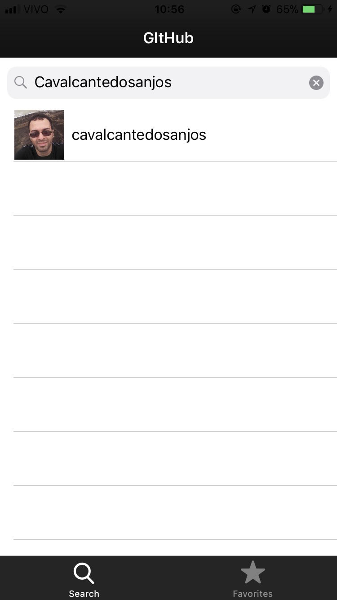
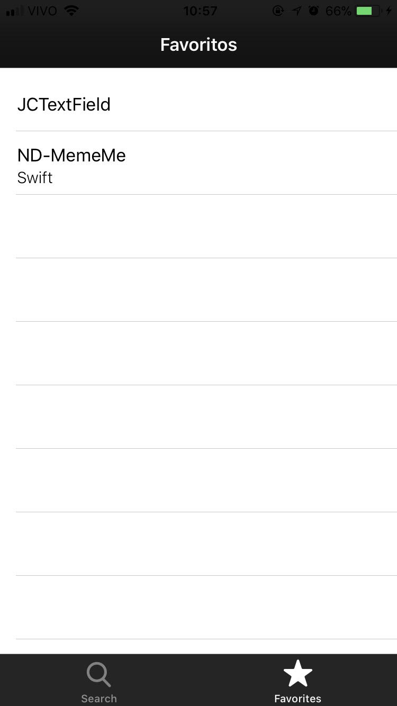
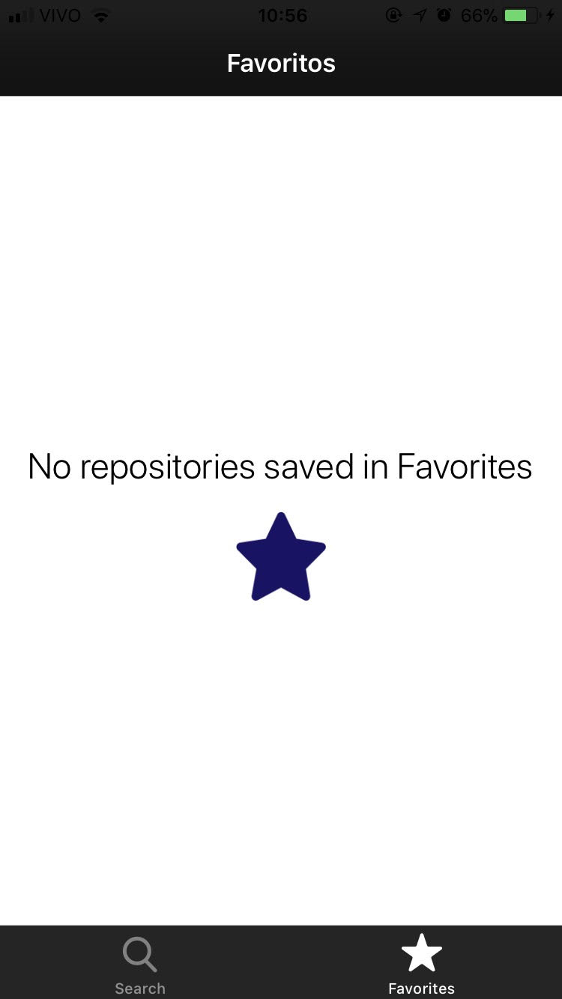

# Installation
Install the dependencies in project

    $ pod install

# Dependencies

### Kingfisher
Helper to download image and manager the cache.
### PKHUD
Loader for application
### DZNEmptyDataSet
Helper to add views in empty TableView and CollectionView

# Screenshots

# License
MIT